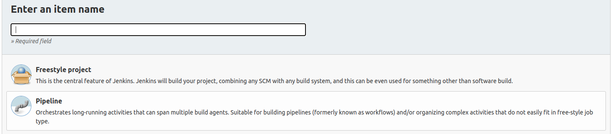
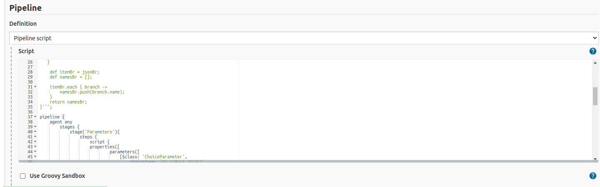
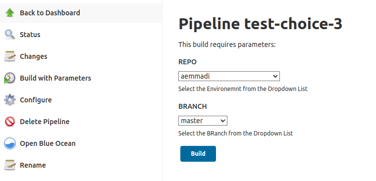

# Configure dynamic jenkins build

## Jenkins Pre-requisites

---

- Plugins:
  - Docker pipeline
  - Active Choices
  - Git
- Credentials:
  - dockerHub

## Steps

---

1. **Create PIPELINE project**
2. **Use the provided jenkinsfile as the pipeline script.**

   

   - Includes the parameters configurations
   - Also build, tags and push to docker hub the image as REPO-NAME:latest
3. **Run the job and provide the parameters from the jenkins dashboard** (Click on Build with Parameters)
   - If the first build fail is because of not specifying the parameters, you need to click on "Build with parameters"
---

|

### Extra: Also the pipeline can be created from the UI

- We Activate project parameters and configure two (Repo and branch) as follows (Grab the scripts for fetching each param):
  - Repo
  - Branch (Reactive parameter) 
- Place the portion of the jenkinsfile that you need
