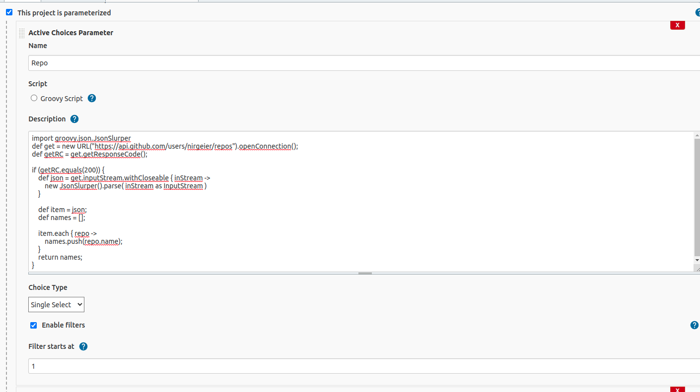
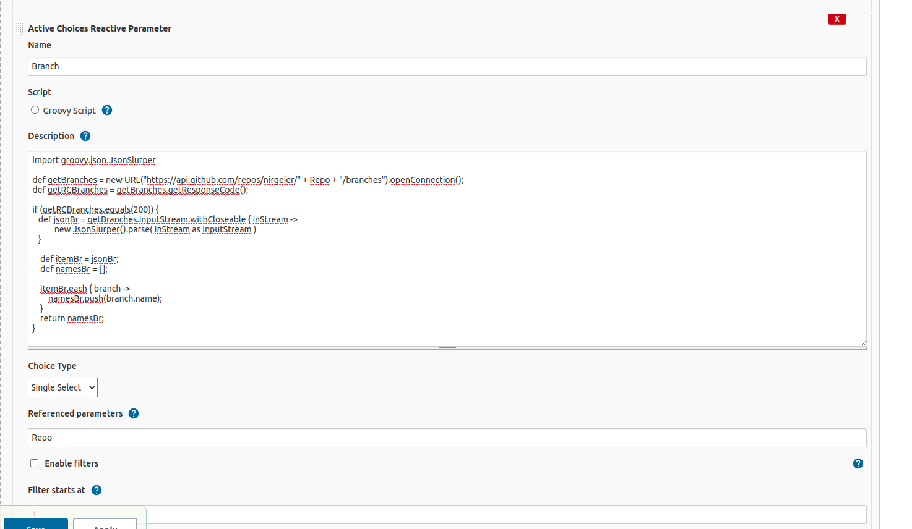

# Configure dynamic jenkins build

- Make sure to have Active Choices Plugin installed
- Create PIPELINE project
- Use the provided jenkinsfile as the pipeline steps.
  - This also includes the parameters configurations

### Or via the UI
- We Activate project parameters and configure two (Repo and branch) as follows (Grab the scripts for fetching each param):
  - Repo
  - Branch (Reactive parameter) 
- Place the portion of the jenkinsfile that you need