# Configure dynamic jenkins build

## Jenkins Pre-requisites

---

- Plugins to Install:
  - Docker pipeline
    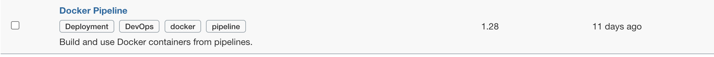
  - Active Choices
    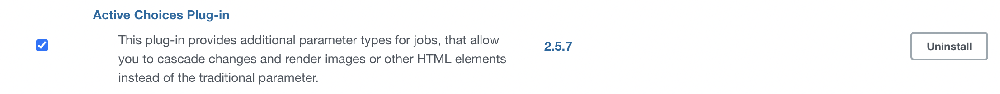
  - CloudBees Credentials Plugin
    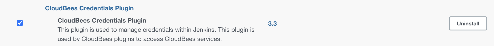

- Credentials:
  - dockerHub Account
  - Github Access Token

 

## Steps to create a personal access token and add it to jenkins
---
 

1. Go to https://github.com/settings/tokens and login with your github account and go to generate token
 
 

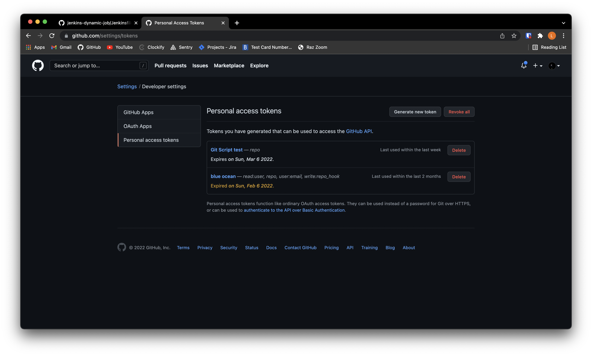

2. Confirm the access with your password
 
 

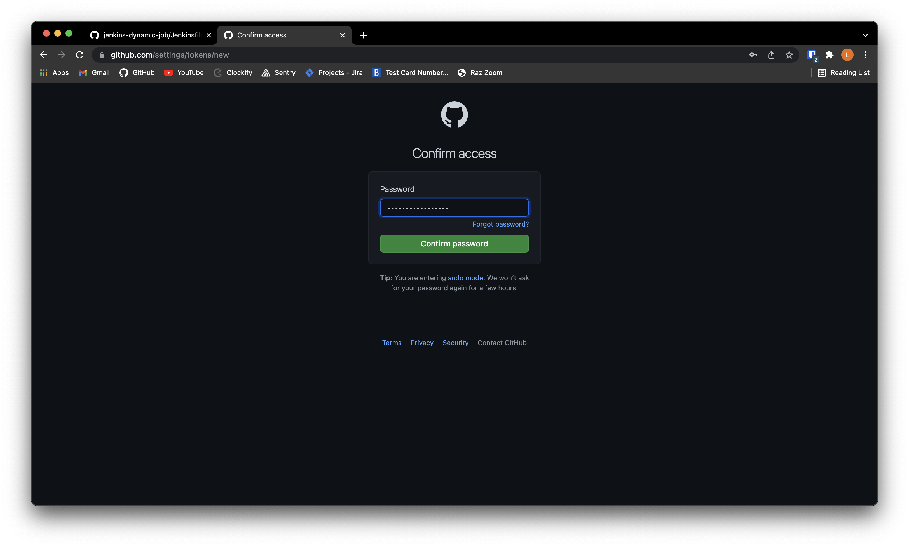

3. Give it a note and select on repo, to give permission to manage repos through the token, then click on generate token
 
 

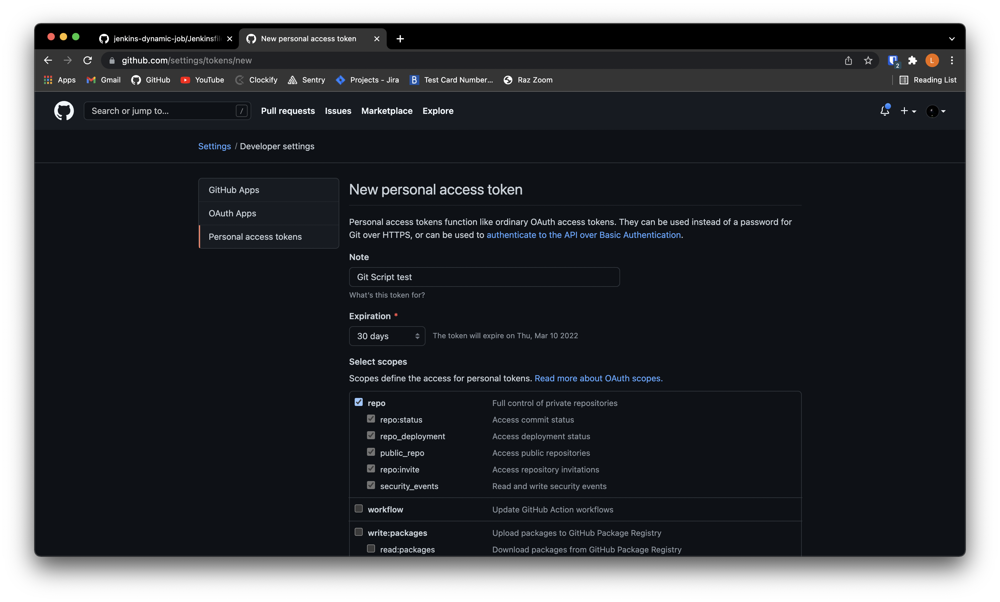

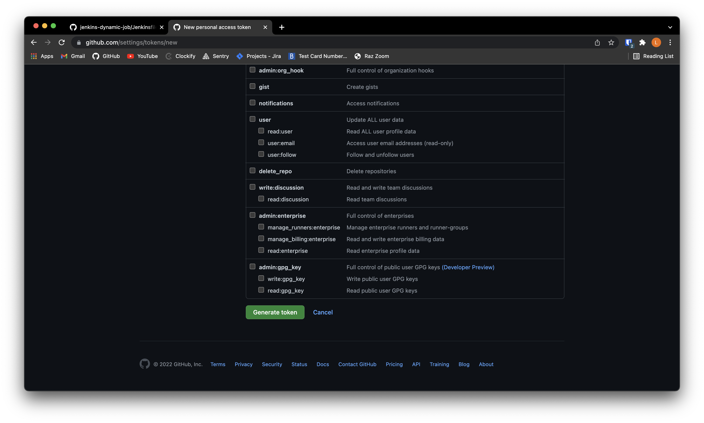

4. Copy the token and save it :)
 
 

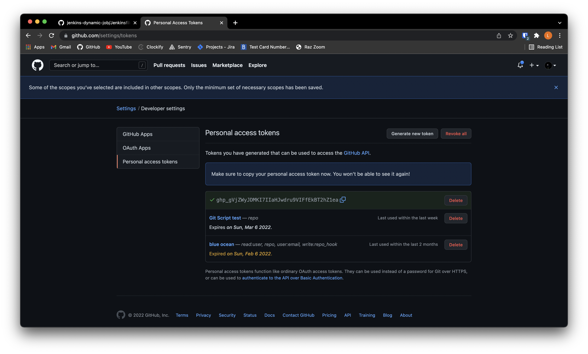

5. In Jenkins, go to Manage Jenkins, and click on the Manage Credentials option
 
 

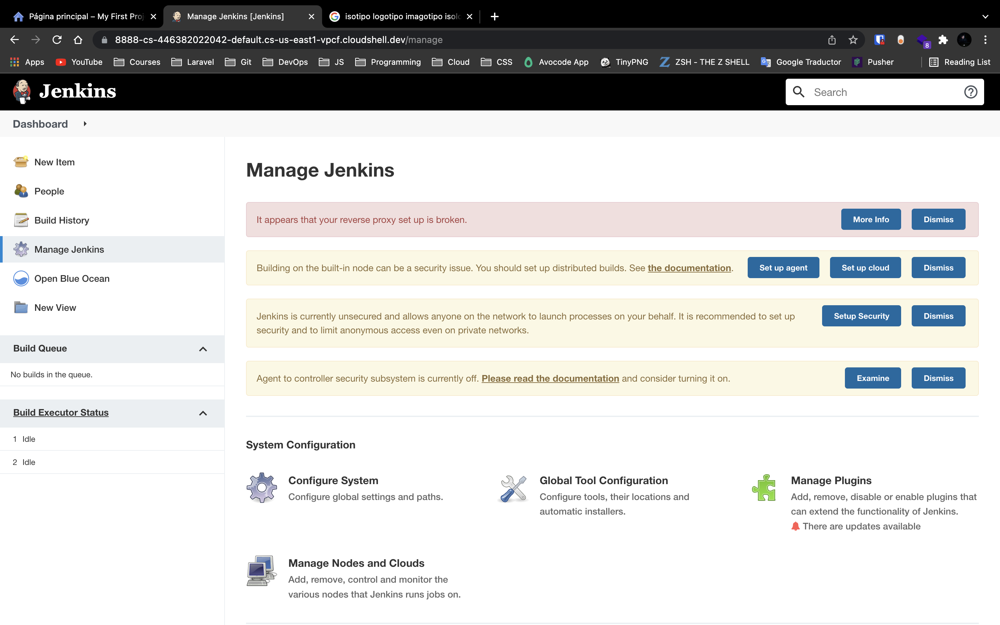

6. Select Jenkins on Store Scope
 
 

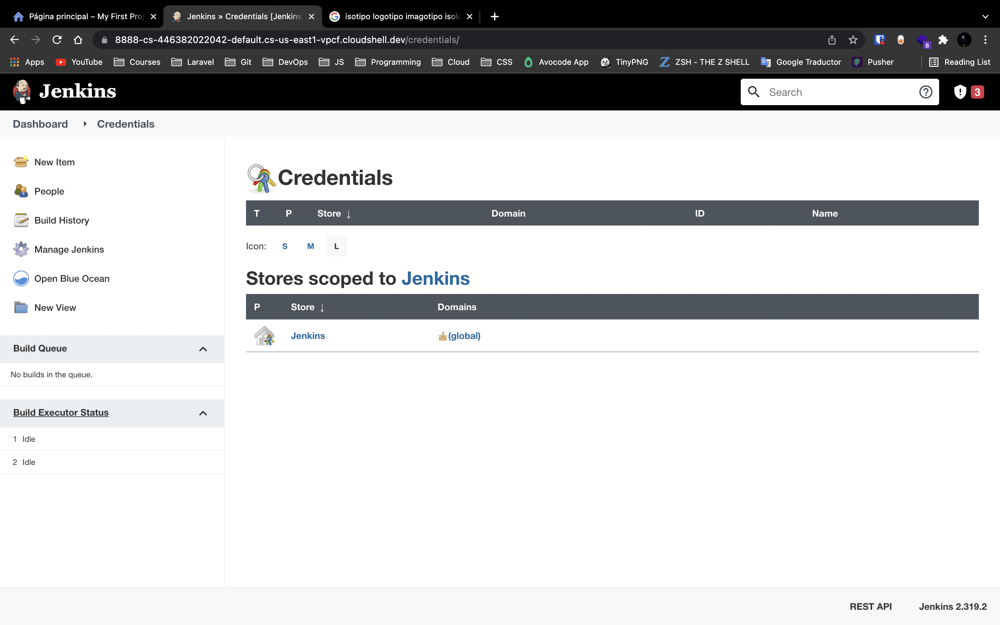

7. Select Global credentials and Add Credentials 
 
 

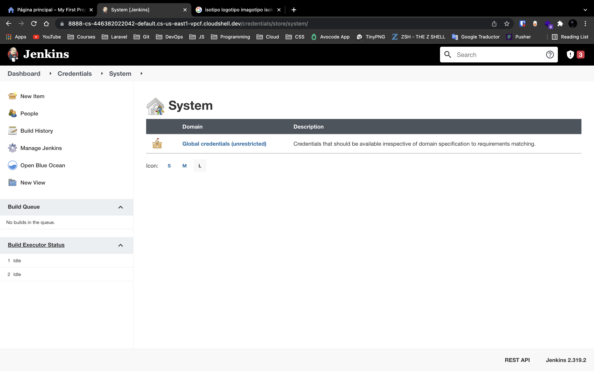

8. On Kind select -> Secret Text, Scope -> Global, Secret -> the github token that we created, ID -> any name and click in okay
 
 

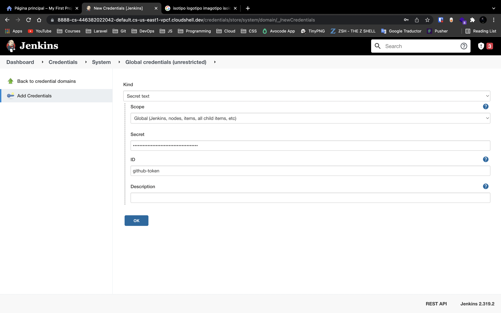

8. We have added our credential
 
 

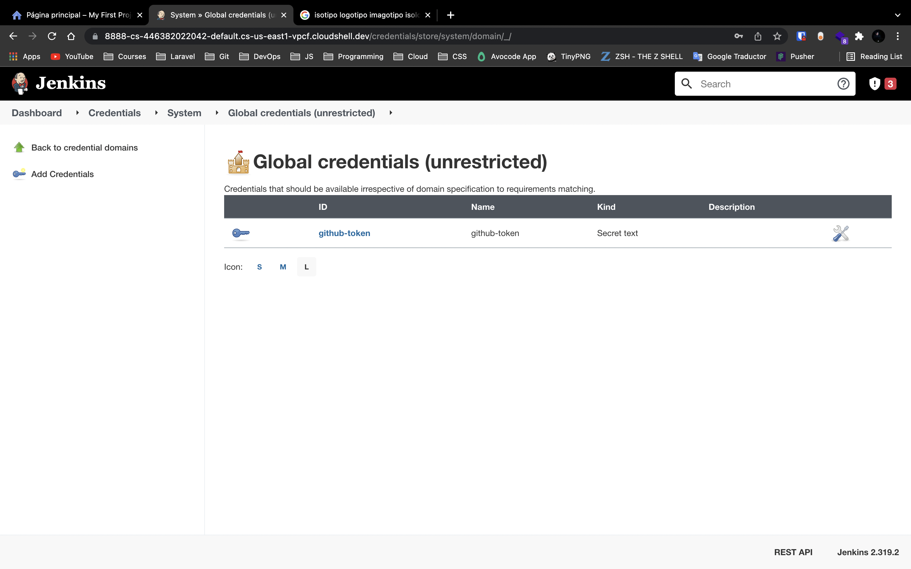

## Steps

---
1. **Create PIPELINE project**

1. **Create PIPELINE project**
2. **Use the provided jenkinsfile as the pipeline script.**

   

   - Includes the parameters configurations
   - Also build, tags and push to docker hub the image as REPO-NAME:latest
3. **Run the job and provide the parameters from the jenkins dashboard** (Click on Build with Parameters)
   - If the first build fail is because of not specifying the parameters, you need to click on "Build with parameters"
---

 
 
 

### Extra: Also the pipeline can be created from the UI

- We Activate project parameters and configure two (Repo and branch) as follows (Grab the scripts for fetching each param):
  - Repo
  - Branch (Reactive parameter) 
- Place the portion of the jenkinsfile that you need

 

---
## Notes
 Change your dockerHubUser in the Jenkinsfile script in order to work properly
